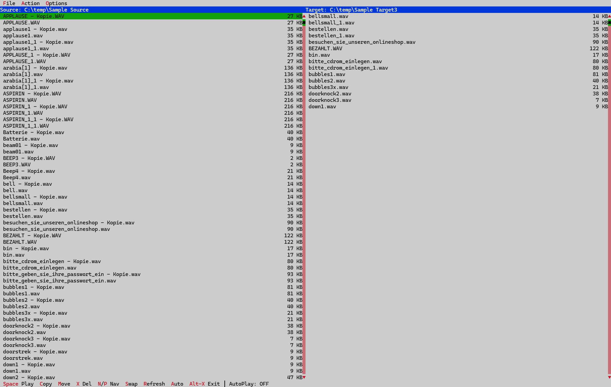

# KeepToss - Audition fast. Keep what hits.

A keyboard-driven audio sample preview and sorting tool with a dual-pane console interface.



## Features

- **Dual-pane view**: Source folder on the left, target folder on the right
- **Live preview**: Files show name and size, both lists update in real-time
- **Audio playback**: Preview WAV samples with space bar
- **Autoplay mode**: Automatically play samples when navigating
- **Single undo**: Reverse the last copy/move/delete operation
- **Auto-rename**: Duplicate filenames get `_1`, `_2` suffix automatically

## Usage

### Interactive Mode
1. Launch the application
2. Enter the source folder path (where your WAV samples are)
3. Enter the target folder path (where to keep/copy samples)
4. Use keyboard shortcuts to audition and sort samples

### Command Line
```
KeepToss.exe [source_folder] [target_folder]
```

Examples:
```
KeepToss.exe                           # Prompt for both folders
KeepToss.exe "C:\Samples\Drums"        # Set source, prompt for target
KeepToss.exe "C:\Samples" "C:\Keep"    # Set both folders, start immediately
```

- Source folder must exist; error shown and prompt displayed if invalid
- Target folder is validated but only created when first file is copied/moved

## Keyboard Shortcuts

### Playback
| Key | Action |
|-----|--------|
| `Space` | Play/stop current sample |
| `A` | Toggle autoplay on/off |

### Navigation
| Key | Action |
|-----|--------|
| `↑` / `P` | Previous sample |
| `↓` / `N` | Next sample |

### File Operations
| Key | Action |
|-----|--------|
| `C` | Copy sample to target folder (auto-advance) |
| `M` | Move sample to target folder (auto-advance) |
| `X` | Delete sample with confirmation (auto-advance) |
| `Shift+X` | Delete sample without confirmation (auto-advance) |
| `Z` | Undo last operation |

### Folder Management
| Key | Action |
|-----|--------|
| `S` | Swap source and target folders |
| `R` | Refresh both folder lists |

### Application
| Key | Action |
|-----|--------|
| `Alt+X` | Exit application |
| `F10` | Access menu bar |

## Mouse Support

| Action | Result |
|--------|--------|
| Click on source list | Select sample and play it |
| Double-click on source list | Copy sample to target folder |
| Double-click on "Source:" header | Open source folder selection |
| Double-click on "Target:" header | Open target folder selection |

## Menu Options

- **File**: Change source/target folders, exit
- **Action**: Copy, Move, Delete, Undo
- **Options**: Toggle Autoplay

## Behavior Notes

- **Manual mode**: Navigating to a new sample stops any playing audio
- **Autoplay mode**: Navigating automatically plays the new sample
- **Auto-advance**: After copy/move/delete, selection moves to next sample
- **Same folder protection**: Warning shown if source and target are identical
- **Empty folder**: Message shown when source folder has no WAV files
- **Target creation**: Target folder is created automatically on first copy/move (not before)
- **Path validation**: Invalid paths are rejected with error message; dialog prompts for correction

## Dependencies

- [Free Vision for Delphi](https://github.com/oldwired/fv-delphi) - Text-mode UI framework (LGPL with linking exception)

## Build

Requires Delphi 10.x or newer.

```
msbuild Source/KeepToss.dproj /p:Config=Debug /p:Platform=Win32
```

Output: `Source\Win32\Debug\KeepToss.exe`

## License

MIT License - see [LICENSE](LICENSE) file.

Note: The Free Vision library has its own license (LGPL with linking exception).
